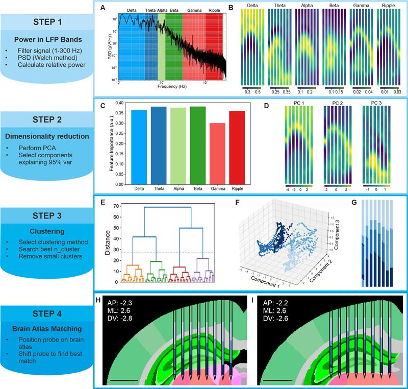

## LFP-LOC

Code associated to the method presented in the paper: "LFP-LOC: an LFP power–based method for the anatomical localization of high-density neural probes" ([link](https://doi.org/10.3389/fnins.2026.1816533)).

Estimate a probe's anatomical location using the power spectral features present in canonical LFP bands. Recording and probe parsing directly handled through SpikeInterface.

|  | 
|:--:| 
| *Overview of the LFP-LOC algorithm* |

### How to install

In the Python environment you plan on using, run the following command:

~~~
pip install lfploc
~~~

### How to use

1. Initialize the recording you intend to use with spikeinterface

    ~~~python
    # example for SiNAPS recording
    from spikeinterface.extractors.sinapsrecordingextractors import read_sinaps_research_platform_h5

    rec_path = r"D:\recording.h5"
    rec = read_sinaps_research_platform_h5(rec_path)
    ~~~

2. Import the LFP-LOC library and initialize a new instance of the Lfploc class

    ~~~python
    from lfploc import Lfploc

    loc = Lfploc(rec)
    ~~~

3. Run an analysis using loc.run()

    ~~~python
    cluster_labels = loc.run(
        feature_extraction_method="PCA",
        clustering_method="hierarchical",
        end_time=50,
        save_report_dir=r"E:\lfploc_report",
        ap=-2.3,
        ml=-2.6,
        dv=-2.5
    )
    ~~~

### Extra information

#### Report

To skip generating the report and extract just the cluster labels, simply skip passing the `save_report_dir` argument.

Report generation (toggled by passing the `save_report_dir` argument) is required when providing ap, ml, and dv coordinates in order to save the plot of the probe overlapped to the atlas.

#### Atlas

Any atlas included with brainglobe-atlasapi should work by default. The atlas used for running the analyses and creating the plots included in the paper is `kim_mouse_isotropic_20um` (also the default parameter). Testing was only performed on the 20um version of this atlas, so changing atlas is highly experimental.

#### Stereotactic coordinates on Atlas

DV is always adjusted to include the offset between the top margin of the image (bregma coordinate) and the start of the cortex on the same coronal plane. This was done since DV coordinates are generally calculated from the surface of the brain rather than from the bregma.

Just the stereotactic coordinates can be plotted on the atlas by running the `loc.place_coordinates_on_atlas(ap, ml, dv, save_report_dir)` method and passing the coordinates and path to where to save the plot generated.